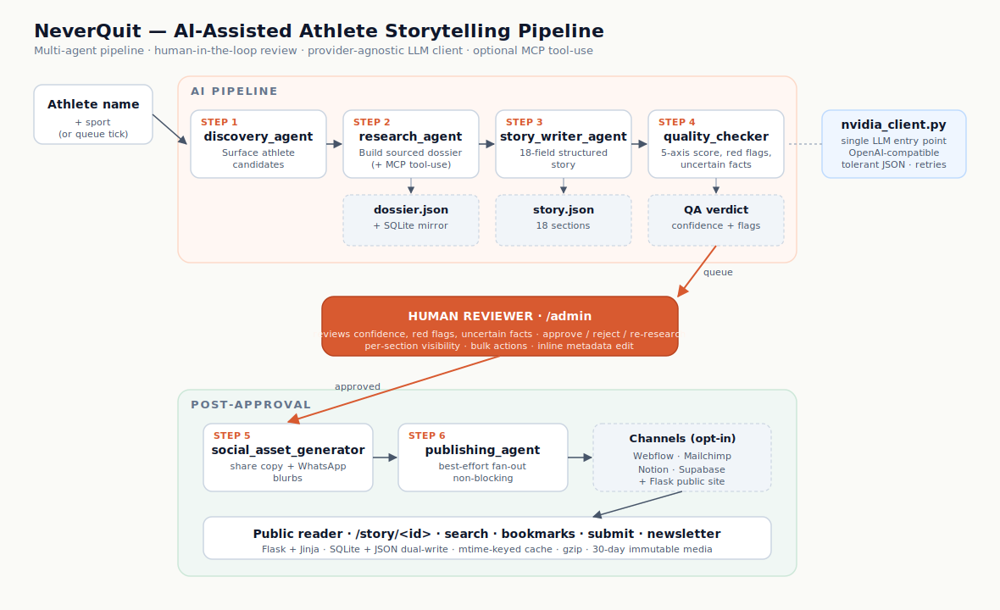

# NeverQuit — AI-Assisted Athlete Storytelling Platform

> **Turn one athlete name into a sourced, fact-checked, editorially-reviewed long-form story — in minutes, not weeks.**

[](https://www.python.org/)
[](https://flask.palletsprojects.com/)
[](https://platform.openai.com/docs/api-reference)
[](https://modelcontextprotocol.io/)
[](https://www.sqlite.org/)
[](./Dockerfile)
[](#deployment)
[](#production-readiness-checklist)

A multi-agent AI pipeline + a production Flask web app for telling **comeback stories of athletes, Paralympians, and differently-abled individuals** — with a human editor gating every publish.

> 🎬 **Demo GIF:** _drop a 20–30 sec capture of the admin pipeline (research → review → approve → publish) into `assets/demo.gif` and replace this line with_ ``.

---

## Architecture at a glance



<sub>6 agents · provider-agnostic LLM client · optional MCP tool-use · human-in-the-loop review · best-effort publish fan-out</sub>

---

## What this project demonstrates

> Framed for engineers, hiring managers, and tech recruiters who read READMEs in <60 seconds.

| Skill | How it shows up in this repo |
|---|---|
| **LLM engineering** | Provider-agnostic client (`nvidia_client.py`), tolerant JSON parsing with `json-repair` fallback, exponential-backoff retries via `tenacity`, 429-aware adaptive throttle, bounded concurrency |
| **Multi-agent orchestration** | 6 specialised agents (discovery → research → writer → QA → social → publish) with isolated prompts, typed output contracts, and graceful per-step degradation — see [Agent Orchestration](#agent-orchestration) |
| **MCP tool-use** | Official `mcp` Python SDK adapter wired into the research agent — activates the moment `mcp_servers.json` exists (web search · fetch · Wikipedia) |
| **Human-in-the-loop product design** | 5-axis confidence scoring with weighted fallback, red-flag surfacing, uncertain-fact pinning, per-section visibility toggles, bulk review actions — editors get *signal*, not auto-publish |
| **Full-stack delivery** | Flask + Jinja editorial UI (Source Serif 4 / Inter), SQLite + JSON dual-write with mtime-keyed in-memory cache, gzip middleware, immutable media caching, background job runner with live progress |
| **Production readiness** | Dockerfile · `render.yaml` · `Procfile` · WSGI entrypoint · `/healthz` · env-driven config · soft-imported optional integrations (Notion, Supabase, Mailchimp, MCP) so missing services no-op cleanly |

---

## By the numbers

| | |
|---|---|
| 🧠 **Specialised agents** | 6 (discovery · research · writer · QA · social · publish) |
| 📝 **Tunable prompt files** | 4 (independently versionable) |
| 🐍 **Python** | ~3,600 LOC across pipeline, utilities, and Flask app |
| 🎨 **Jinja templates** | 11 (editorial reader + 5-page admin console) |
| 📊 **QA scoring axes** | 5 (factual_consistency · quote_integrity · tone · completeness · cultural_sensitivity) |
| 📐 **Story template fields** | 18 (hook, darkest_moment, turning_point, comeback_timeline, lessons, pull_quote, goal_box, …) |
| 🔌 **Optional integrations** | 5 (Webflow · Mailchimp · Notion · Supabase · MCP) — every one soft-imports |
| 🚀 **Deploy targets ready** | Docker · Render · Fly · Railway · any WSGI host |

---

## Screenshots

> _Drop into `assets/` and replace these placeholders:_
>
> | Public reader | Admin review queue | Confidence + red flags |
> |---|---|---|
> | `` | `` | `` |

---

## Pipeline flow

<details>
<summary>ASCII flow (text fallback for the diagram above)</summary>

```
              ┌───────────────────────── AI PIPELINE ─────────────────────────┐
              │                                                               │
  athlete  →  │  discovery → research → story writer → quality checker        │
   name       │     │           │            │               │               │
              │     ▼           ▼            ▼               ▼               │
              │  queue.json   dossier      sections     confidence + flags    │
              │              (SQLite +    (structured                         │
              │               JSON)        template)                         │
              └───────────────────────────────┬───────────────────────────────┘
                                              │
                              ┌───────────────▼───────────────┐
                              │       FLASK WEB APP            │
                              │                                │
   public reader  ◄───────────┤  /             public home     │
   (cards, search,            │  /story/<id>   story reader     │
    bookmarks, submit)        │  /saved        reading list     │
                              │  /submit       athlete suggest  │
                              │                                │
   admin console  ◄───────────┤  /admin        review+pipeline  │
   (review, approve,          │  /admin/...    subscribers, bulk│
    bulk actions,             │                actions, jobs   │
    visibility control)       └───────────────┬────────────────┘
                                              │
                          ┌───────────────────▼────────────────────┐
                          │  PUBLISHING (opt-in via env keys)       │
                          │  Webflow · Mailchimp · Notion · Supabase│
                          └─────────────────────────────────────────┘
```

</details>

**End-to-end:** `discovery → research → write → QA → human approval → publish → social assets`

1. **`discovery_agent`** finds athlete candidates and queues them in `data/athlete_queue.json`.
2. **`research_agent`** builds a sourced dossier (birth, struggles, turning point, quotes, competitions, outcomes) — mirrored to SQLite, with optional MCP tool-use enrichment.
3. **`story_writer_agent`** turns the dossier into a structured 10+ section story.
4. **`quality_checker_agent`** scores editorial confidence and flags unverified claims.
5. The **admin console** moves stories through `pending_review → approved / rejected → published`.
6. **`publishing_agent`** pushes approved stories to connected services (all opt-in, best-effort, non-blocking).

---

## Agent Orchestration

Six specialised agents hand off in a fixed sequence. Each one is a structured LLM call with an isolated prompt, its own retry/parse logic, and a tightly-typed output contract — so a failure in any single step is contained.

| # | Agent | Role | Input | Output |
|---|---|---|---|---|
| 1 | `discovery_agent` | Surface athlete candidates worth profiling | Seed topic / sport / region (or empty queue) | Candidate rows appended to `data/athlete_queue.json` |
| 2 | `research_agent` | Build a sourced dossier; optionally enrich via **MCP tool-use** (web search, fetch, Wikipedia) | Athlete name + sport | `dossier.json` (birth, struggles, turning point, exact quotes, competitions, outcomes, `uncertain_facts[]`) + SQLite mirror |
| 3 | `story_writer_agent` | Turn the dossier into an 18-field structured story matching `templates/story_template.json` | Dossier JSON | `story.json` (hook, darkest_moment, turning_point, comeback_timeline, lessons, pull_quote, goal_box, …) |
| 4 | `quality_checker_agent` | Strict editorial QA — score, flag, gate | Story + dossier | `{ scores, confidence_score, red_flags[], uncertain_facts[], verdict }` |
| 5 | `social_asset_generator` | Generate share copy + WhatsApp blurbs from the approved story | Approved story | Social asset block on the story record |
| 6 | `publishing_agent` | Best-effort push to connected channels (Webflow / Mailchimp / Notion / Supabase) | Approved story + asset block | Per-target publish status (any single target can fail without blocking the rest) |

Between steps 4 and 5 sits the **human reviewer** — the admin console surfaces confidence, red flags, and uncertain facts so an editor approves, rejects, or sends back for re-research. Nothing auto-publishes by default.

---

## Confidence Scoring

The quality checker scores every story on **five axes (0–100)** and produces a weighted `confidence_score` the admin UI uses to prioritise the review queue:

| Axis | What it measures |
|---|---|
| `factual_consistency` | Every claim is backed by the dossier; no content from `dossier.uncertain_facts` |
| `quote_integrity` | Every quoted sentence appears verbatim in the dossier's `exact_quotes` (paraphrase-as-quote → automatic 0) |
| `tone` | Vivid, specific, restrained — no generic motivational filler, no melodrama, correct second-person voice in reader-facing fields |
| `completeness` | All 18 template fields present with correct cardinality (e.g. `tiny_practices` ×3, `body_protocol` ×4, `lessons` ×3) |
| `cultural_sensitivity` | Disability described precisely (not euphemistically); no saviour framing |

Alongside the score, the QA agent emits:

- **`red_flags[]`** — `{ section, issue, severity: low|medium|high }` per problem (rendered as pills in the review UI)
- **`uncertain_facts[]`** — verbatim claims the editor must verify before publishing
- **`verdict`** — `approve | review | reject` (advisory; the editor has final say)

Defensive layer in code (`quality_checker_agent.py`): if the model omits `confidence_score`, the agent **falls back to the mean of the per-axis scores** so the queue never breaks on a malformed response. The threshold for auto-approve is env-tunable via `AUTO_APPROVE_THRESHOLD`, and stories below `MIN_CONFIDENCE_SCORE` are routed straight to manual review.

---

## Provider-Agnostic LLM Client

`scripts/utils/nvidia_client.py` is the single LLM entry point every agent imports — swapping providers is an env-var change, not a code change.

- **OpenAI-compatible interface** — works with any OpenAI-protocol endpoint (NVIDIA-hosted by default; trivially repointed at OpenAI / Groq / Together / a local vLLM)
- **Two surface methods** — `complete()` for free text, `complete_json()` for structured output with tolerant parsing (strips markdown fences, repairs trailing commas / smart quotes, falls back to `json-repair`, retries on malformed output)
- **Per-call model override** — research and story-writing models are configured independently (`NVIDIA_MODEL` and `NVIDIA_STORY_MODEL`), so you can pair a cheap reasoning model with a stronger writer
- **Resilience built in** — exponential-backoff retry via `tenacity`, thread-safe pacing (`NVIDIA_MIN_INTERVAL_S`), bounded concurrency (`NVIDIA_MAX_CONCURRENT`), 429-aware adaptive throttle that parses "retry in Xs" hints
- **No client shims** — `claude_client.py` / `gemini_client.py` aliases were removed; every agent imports `nvidia_client` directly

**MCP tool-use layer** — `scripts/utils/mcp_research.py` uses the official Anthropic `mcp` Python SDK (`ClientSession` over stdio) to let the research agent call external tool servers (web search, fetch, Wikipedia). It activates only when `mcp_servers.json` exists — copy `mcp_servers.example.json` to enable. The integration is **wired and dormant** by default so the project boots without the optional dependency.

---

## Key Features

### AI pipeline
- **Single provider-agnostic LLM client** (`nvidia_client.py`) over an OpenAI-compatible API — every agent imports it directly, no duplicate wrappers
- **Tolerant JSON parsing** — strips markdown fences, repairs malformed model output, retries on rate limits with exponential backoff
- **Per-agent prompt files** in `prompts/` — research, story writing, QA, and social assets are independently tunable
- **Optional MCP tool-use** (`mcp_research.py`) — a Model Context Protocol adapter (official `mcp` SDK) that lets the research agent call web-search / fetch / Wikipedia servers. Built and wired in; **dormant until you add `mcp_servers.json`** (copy from `mcp_servers.example.json`).
- **Independently configurable models** — research and story-writing models set via separate env vars

### User interface
- **Editorial design system** — Source Serif 4 (headlines, prose) + Inter (UI), warm `#D85A30` accent, hairline borders, soft corners
- **Light & dark themes** — toggle in the nav, respects `prefers-color-scheme`, persisted to `localStorage`
- **Long-form story reader** — sticky rail, scroll-progress bar, drop-cap lede, key-facts tiles, pull-quotes, comeback timeline, numbered takeaways, goal box, inline newsletter, "continue reading" rail
- **Dynamic home** — editorial hero, live stats band, filter chips, featured story, infinite-scroll story grid backed by `/api/stories.json`
- See `understand_UI.md` for a complete component-by-component UI reference

### Admin console
- **Review queue** with confidence scores, QA red flags, and uncertain-fact surfacing
- **Bulk actions** — approve / reject / unpublish many stories at once
- **Per-section public visibility** — hide any of 21 story sections from the public reader without deleting content; one-click presets (Show all / Story only / Minimal)
- **Inline metadata editing** — fix athlete name, sport, country without re-running the pipeline
- **Live job runner** — background pipeline jobs with real-time progress, step tracking, and auto-refresh
- **Research dossier viewer** with field-coverage scoring and re-research using a different model
- **Subscriber management** — add, export CSV, resend welcome emails, broadcast updates

### Public site
- Responsive home with **live search**, sport/type filter chips, and a dynamic story grid
- Distraction-free **story reader** — reading-progress bar, real reading-time estimate, country flags, bookmark/save, copy-link
- **`/saved`** — a personal reading list (localStorage, no login required)
- **`/submit`** — community submission form for suggesting athletes
- **Newsletter capture** — floating pill, inline story CTA, dark newsletter band

### Engineering
- **SQLite persistence** with an mtime-keyed in-memory cache layer for `list_stories()`
- **gzip middleware** — compresses HTML/JSON responses ~70%
- **Aggressive media caching** — athlete photos served with 30-day immutable cache headers
- **Visit analytics** — privacy-respecting (hashed IP) page-view tracking
- **SMTP mailer** — HTML welcome emails and admin broadcasts
- **Graceful degradation** — optional integrations (Notion, Supabase, MCP) soft-import and no-op when unconfigured

---

## Tech Stack

| Layer | Choice |
|---|---|
| Language | Python 3.10+ |
| Web framework | Flask |
| Persistence | SQLite (+ human-readable JSON backups), optional Supabase |
| LLM | OpenAI-compatible API (NVIDIA-hosted models) |
| Email | SMTP + optional Mailchimp |
| Publishing | Webflow, Notion (all optional) |
| Serving | Waitress / Gunicorn |
| Deploy | Docker, Render, Fly, Railway, or any WSGI host |

---

## Quickstart

```bash
# 1. Clone
git clone https://github.com/Abhishek9124/NeverQuit-AI-Assisted-Athlete-Storytelling-Platform.git
cd NeverQuit-AI-Assisted-Athlete-Storytelling-Platform

# 2. Virtual environment
python -m venv venv
venv\Scripts\activate          # Windows
# source venv/bin/activate     # macOS / Linux

# 3. Install core dependencies
pip install flask python-dotenv openai requests tenacity json-repair Pillow waitress

# 4. Configure environment
cp .env.example .env           # then edit — see below

# 5. Run
python wsgi.py                 # development
# waitress-serve --listen=0.0.0.0:5000 wsgi:app   # production-style
```

Open **http://localhost:5000** (public site) and **http://localhost:5000/admin** (console).

### Minimum `.env`

```ini
NVIDIA_API_KEY=your-key-here
NVIDIA_STORY_MODEL=openai/gpt-oss-20b
NVIDIA_MODEL=nvidia/nemotron-3-nano-omni-30b-a3b-reasoning
ADMIN_TOKEN=choose-a-secret     # leave blank for open dev mode
FLASK_SECRET=any-random-string
```

Everything else in `.env.example` (SMTP, Mailchimp, Webflow, Notion, Supabase) is
**optional** — the app boots and runs without any of it.

---

## Running the Pipeline

```bash
# Full end-to-end run for one athlete
python scripts/pipeline/run_pipeline.py --athlete "Neeraj Chopra" --sport "Javelin"

# Process the daily queue
python scripts/pipeline/run_pipeline.py --quota 1

# Dry run — generate without auto-publishing
python scripts/pipeline/run_pipeline.py --quota 1 --dry-run
```

Or drive it from the admin console: **`/admin` → Research → enter a name → Write story → Review → Approve**.
Stories land in `data/stories/` as JSON and mirror to `data/neverquit.sqlite`.

---

## Project Structure

```
scripts/
├── dashboard/
│   ├── app.py              # Flask app — routes, admin console, job runner
│   ├── seed_stories.py     # demo stories shown before the DB is populated
│   └── templates/          # Jinja2 templates (editorial UI)
│       ├── base.html              # shell — nav, theme, fonts, design tokens
│       ├── public_home.html       # editorial home — hero, stats, story grid
│       ├── public_story.html      # wraps the story reader
│       ├── _story_body.html       # long-form story reader
│       ├── saved.html · submit.html
│       └── admin_*.html           # admin console pages
├── pipeline/
│   ├── discovery_agent.py        # finds athlete candidates
│   ├── research_agent.py         # builds sourced dossiers (+ optional MCP)
│   ├── story_writer_agent.py     # dossier → structured story
│   ├── quality_checker_agent.py  # confidence scoring + fact flags
│   ├── publishing_agent.py       # pushes to external services
│   ├── social_asset_generator.py
│   └── run_pipeline.py           # end-to-end orchestrator
└── utils/
    ├── nvidia_client.py    # provider-agnostic LLM client
    ├── db.py               # SQLite layer
    ├── storage.py          # JSON store + mtime-keyed cache
    ├── mailer.py           # SMTP welcome emails + broadcasts
    ├── image_fetcher.py    # athlete photo lookup
    ├── country_flags.py    # ISO code + flag helpers
    └── mcp_research.py     # optional MCP tool-use adapter
prompts/                    # per-agent prompt files
templates/story_template.json
docs/                       # architecture, deployment, DB-choice notes
understand_UI.md            # full UI component reference
data/                       # SQLite DB, story JSON, images (gitignored)
```

### Important routes

| Route | Purpose |
|---|---|
| `/` | Public home — search, filters, story cards |
| `/story/<id>` | Story reader |
| `/saved` · `/submit` | Reading list · community submission form |
| `/admin` | Admin console — review queue, pipeline tools, live jobs |
| `/admin/run-research` · `/admin/run-pipeline` | Trigger pipeline stages |
| `/admin/subscribers` | Newsletter management + broadcasts |
| `/healthz` | Health check |

---

## Data Storage

A hybrid local model:

- **JSON files** in `data/stories/` and `data/dossiers/` — human-readable backups, source of truth for the cache
- **SQLite** at `data/neverquit.sqlite` — query-friendly persistence, mirrored on every write
- **Queue state** in `data/athlete_queue.json`

Rationale for SQLite over a hosted DB is documented in `docs/database_choice.md`.

---

## Environment Variables

**Core** — `NVIDIA_API_KEY`, `NVIDIA_MODEL`, `NVIDIA_STORY_MODEL`, `ADMIN_TOKEN`, `FLASK_SECRET`, `PORT`

**Pipeline tuning** — `DAILY_STORY_QUOTA`, `MIN_CONFIDENCE_SCORE`, `AUTO_APPROVE_THRESHOLD`, `NVIDIA_MIN_INTERVAL_S`, `NVIDIA_MAX_CONCURRENT`

**Optional integrations** — `SMTP_*`, `MAILCHIMP_*`, `WEBFLOW_*`, `NOTION_*`, `SUPABASE_*`

See `.env.example` for the full annotated list.

---

## Deployment

The repo ships with `Dockerfile`, `render.yaml`, `Procfile`, and `wsgi.py`.

```bash
# Docker
docker build -t neverquit .
docker run -p 5000:5000 --env-file .env neverquit

# Any WSGI host
waitress-serve --listen=0.0.0.0:5000 wsgi:app
```

The app runs as a **single Flask service** serving both the public site and the admin console. See `docs/deployment.md` for platform-specific notes.

### Production readiness checklist

Before going live, confirm:

- [ ] `ADMIN_TOKEN` is set to a strong secret (an empty token leaves admin open)
- [ ] `FLASK_SECRET` is set to a random string (not the default)
- [ ] `FLASK_DEBUG` is unset or `0` — debug mode never ships to production
- [ ] Served via a WSGI server (`waitress` / `gunicorn`), **not** `python wsgi.py`
- [ ] `NVIDIA_API_KEY` and model env vars are configured
- [ ] `data/` is on a persistent volume (it holds the SQLite DB, stories, images)
- [ ] HTTPS terminates at the host/reverse proxy
- [ ] Optional integration keys (SMTP, Mailchimp, Webflow, Notion) are set only if those features are needed

Already handled in code: debug defaults **off**, optional dependencies **soft-import**, responses **gzip-compressed**, media served with **immutable cache headers**, `/healthz` endpoint for liveness probes, and graceful no-op when integrations are unconfigured.

---

## Design Decisions & Trade-offs

- **SQLite over Postgres** — single-file persistence keeps the project portable and zero-config; the `db.py` layer is thin enough to swap later.
- **JSON + SQLite dual write** — JSON files are human-readable backups; SQLite powers fast queries.
- **Human-in-the-loop by default** — no story auto-publishes. Confidence scores and red flags *inform* the editor; they don't replace them.
- **Optional integrations soft-import** — the app never crashes because Notion or Supabase isn't installed; missing services simply no-op.
- **Provider-agnostic LLM layer** — swapping models or providers is an env-var change, not a code change.
- **Best-effort publishing** — if one publishing target fails, the others still run.

---

## Docs

- `understand_UI.md` — complete UI reference (design tokens, components, every page)
- `docs/pipeline_architecture.md` — agent flow in detail
- `docs/deployment.md` — platform-specific deploy notes
- `docs/approval_dashboard_guide.md` — admin console walkthrough
- `docs/database_choice.md` — why SQLite

---

## Honest scope notes

- **"Agents" = a fixed pipeline, not autonomous agents.** Each agent is a structured LLM call with its own prompt; `run_pipeline.py` orchestrates them in a fixed sequence. They don't self-plan or loop.
- **MCP is built but dormant.** `mcp_research.py` is fully wired into the research agent, but it only activates when `mcp_servers.json` exists. Out of the box, no story uses MCP — research runs on the LLM alone.
- **Translation scaffolding exists** but the orchestrator is effectively English-only.
- **Python 3.10+ required** (the `mcp` SDK and several deps need it). On Python 3.14, install the core deps individually — `supabase` may fail to build there and is optional anyway.
- If `ADMIN_TOKEN` is empty, the admin interface is open in local development mode.

---

## License

This project is for portfolio and educational purposes.
